<div align="center">

# 🛡️ Project A.E.G.I.S.
### Autonomous Embedding-Guided Intelligence System


**Physics-Aware Computer Vision for Real-Time Disaster Prediction**

[🚀 Live Demo](https://huggingface.co/spaces/KanavjeetS/aegis-demo) | [📄 Documentation](docs/) | [🪲 Report Bug](https://github.com/KanavjeetS/project-aegis/issues)

</div>

---

## 📖 Overview

**A.E.G.I.S.** represents a paradigm shift in disaster management technology. Unlike traditional classification models that react to events, A.E.G.I.S. utilizes **Video Joint Embedding Predictive Architecture (V-JEPA)** to understand the temporal dynamics and physics of unfolding disasters.

By combining self-supervised learning with a **Vision-Language Model (VLM)**, A.E.G.I.S. doesn't just detect floods or wildfires—it narrates the threat level in plain English, enabling instant, interpretable alerts from edge devices.

## ✨ Key Features

| Feature | Description | Tech Stack |
| :--- | :--- | :--- |
| **🔮 Physics-Aware Prediction** | Understands causality and object permanence in video streams. | V-JEPA, ViT |
| **🗣️ Natural Language Alerts** | Generates human-readable warnings (e.g., "Severe flooding detected"). | Llama 3.1, Q-Former |
| **⚡ Edge-Optimized** | Runs on NVIDIA Jetson/RPi with INT8 quantization. | ONNX, TensorRT |
| **🔄 Full Pipeline** | End-to-end handling from data ingestion to Kubernetes deployment. | FastAPI, Docker, K8s |

## 🏗️ Architecture

```mermaid
graph TD
    A["🎥 Video Feed"] -->|Frames| B("V-JEPA Encoder")
    B -->|Latent Embeddings| C{"Predictor"}
    C -->|Future States| D["Physics-Aware Loss"]
    B -->|Visual Tokens| E["Q-Former"]
    E -->|Query| F["Llama 3.1 VLM"]
    F -->|Text Alert| G["📢 Flood Levels Rising!"]
```



## 🚀 Quick Start

### ☁️ Run in Colab (No Setup)
The fastest way to try A.E.G.I.S. is via our Google Colab notebook, which includes a working demo and synthetic data generator.

[](notebooks/01_colab_quickstart.ipynb)

### 💻 Local Installation

1. **Clone the repository**
   ```bash
   git clone https://github.com/KanavjeetS/project-aegis.git
   cd project-aegis
   ```

2. **Install Dependencies**
   ```bash
   pip install -r requirements.txt
   ```

3. **Run the API & Demo**
   ```bash
   # Start the API
   uvicorn api.api_server:app --reload

   # Start the Web UI
   python demo/gradio_app.py
   ```

## 📂 Project Structure

```bash
project-aegis/
├── 🧠 models/          # V-JEPA & VLM Model Architectures
├── 🔌 api/             # Production FastAPI Server
├── 🎮 demo/            # Gradio Web Interface
├── 📦 deployment/      # Docker, K8s, & Quantization
├── 📊 evaluation/      # Metrics (BLEU, METEOR, CIDEr)
├── 💾 data/            # Synthetic Generators & Downloaders
└── 📝 docs/            # Comprehensive Documentation
```

## 📚 Documentation

- [**Installation Guide**](docs/SETUP.md): Detailed local and Docker setup.
- [**Training Guide**](docs/TRAINING.md): How to train V-JEPA from scratch.
- [**Deployment**](docs/DEPLOYMENT.md): Edge and Cloud deployment strategies.
- [**API Reference**](docs/reports/ADVANCED_FEATURES.md): API endpoint documentation.

## 🤝 Contributing

We welcome contributions! Please see [CONTRIBUTING.md](CONTRIBUTING.md) for guidelines.

## 📜 License

This project is licensed under the MIT License - see the [LICENSE](LICENSE) file for details.

## ✍️ Citation

If you use A.E.G.I.S. in your research, please cite:

```bibtex
@software{aegis2026,
  author = {Singh, Kanavjeet},
  title = {A.E.G.I.S.: Autonomous Embedding-Guided Intelligence System},
  year = {2026},
  url = {https://github.com/KanavjeetS/project-aegis}
}
```

---
<div align="center">
  <sub>Built with ❤️ for a Safer World by <a href="https://github.com/KanavjeetS">Kanavjeet Singh</a></sub>
</div>
